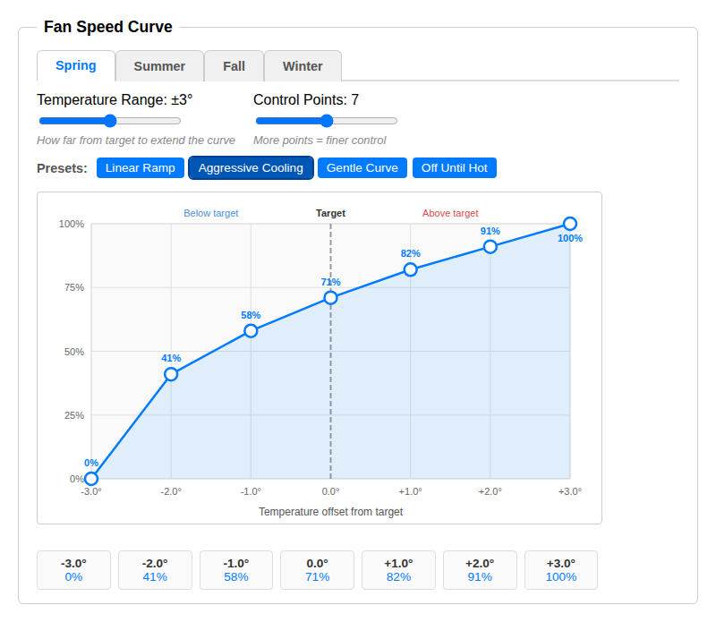

# Auto Fan - Indigo Plugin

Automatic fan speed control for [Indigo 2025.1](https://www.indigodomo.com/).

This plugin creates zones for each area where you have a ceiling fan controlled by Indigo, and uses sensor data to dynamically set the fan speed based on the current conditions. The idea is inspired by "smart" fans that adjust speed according to temperature, but this plugin allows for a much more granular level of control because it aggregates data from all of the sensors linked in Indigo.

## Features

### Automatic Fan Speed

The plugin automatically adjusts fan speed based on data from your existing Indigo devices:

- **Temperature sensors** — Reads one or more sensors per zone and compares to your ideal temperature to determine how fast the fan should run. Supports multiple sensors (averaged together).
- **Seasonal fan curves** — Each zone has four fan speed curves (spring, summer, fall, winter) that map temperature offset to fan speed. Configure them visually with an interactive drag-and-drop chart editor, or apply presets like Linear Ramp, Aggressive Cooling, Gentle Curve, and Off Until Hot.

  
- **HVAC awareness** — Boosts fan speed when AC is cooling, or reduces it when the heater is running.
- **Humidity boost** — Increases fan speed when humidity is above a threshold.
- **Nighttime mode** — Per-season quiet hours that clamp fan speed to a configured range so fans don't blast at 3am.
- **Presence detection** — Uses a global home/away variable to limit fan speed when no one is home.
- **Ideal temperature** — Per-season ideal temperature settings. Each season can independently use a static value, an Indigo variable, or thermostat setpoints. This lets you target a cooler ideal in summer and a warmer one in winter.
- **Season detection** — Automatic detection based on calendar month with hemisphere support (Northern/Southern), or driven by an Indigo variable for full manual control.
- **Outdoor temperature** — Displays outdoor temperature from a configured weather device on each zone's Indigo device state.

### Manual Override (Zone Locking)

When someone manually changes a fan speed — via wall switch, Indigo UI, Siri, etc. — the zone **locks** and automation pauses for that zone.

- Locks expire after a configurable duration (default: 60 minutes)
- If presence is still detected when the lock is about to expire, it extends automatically (default: 30 minutes)
- Locks can be cleared manually via the plugin menu or web interface
- Lock duration and extension can be overridden per-zone

### Smart Logging

When multiple sensors for a zone update simultaneously, the plugin aggregates all changes within a 1-second window and produces a single consolidated log entry showing everything that changed and the resulting speed decision.

### Web Configuration

Browser-based config editor accessible via Indigo's plugin menu (**Plugins → Auto Fan → Open Web Configuration**) for managing zones, curves, and modifiers.

## Installation

1. Download the latest release zip
2. Double-click to install in Indigo, or copy `Auto Fan.indigoPlugin` to your Indigo Plugins folder
3. Enable the plugin in Indigo's plugin menu

## License

MIT
